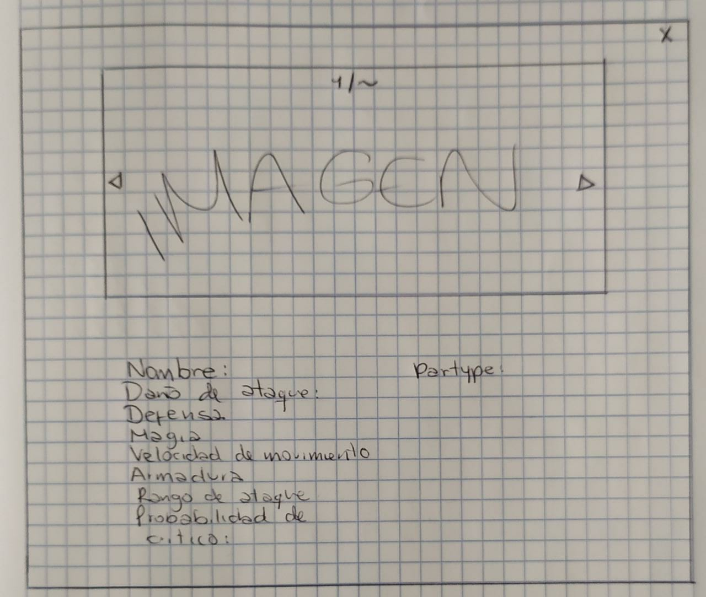
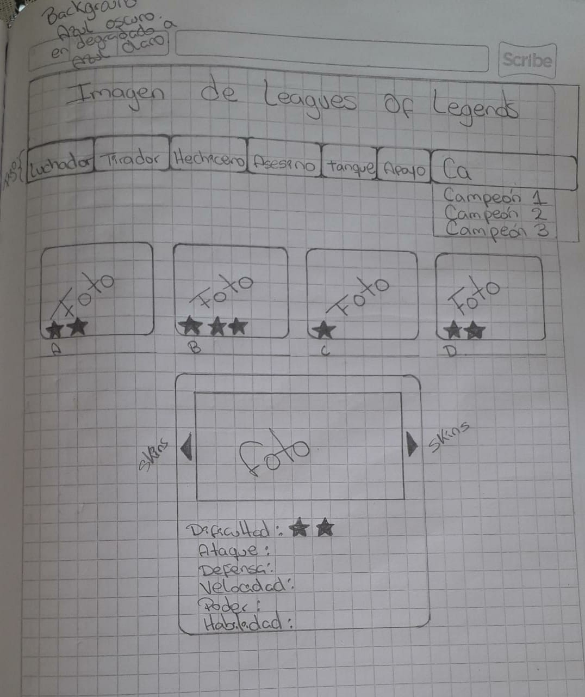
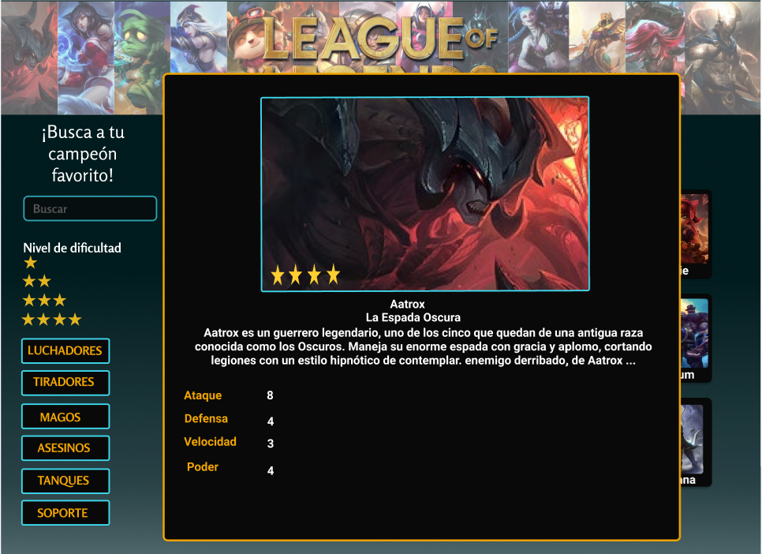
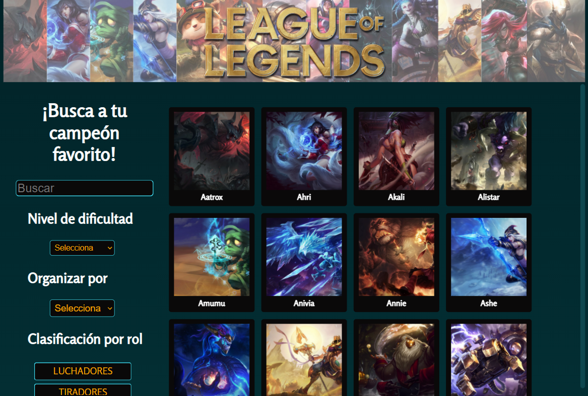
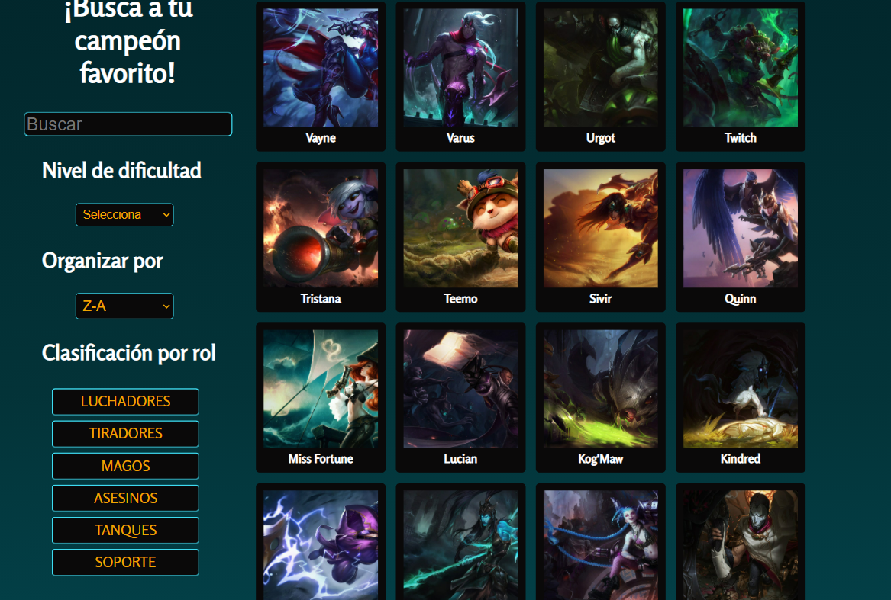
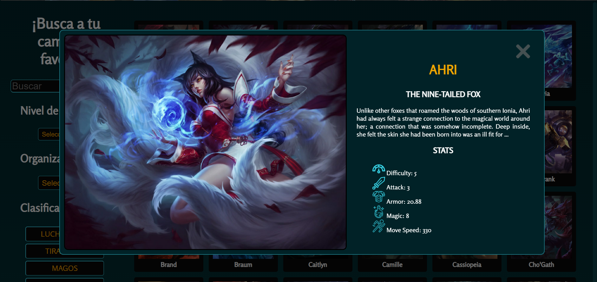
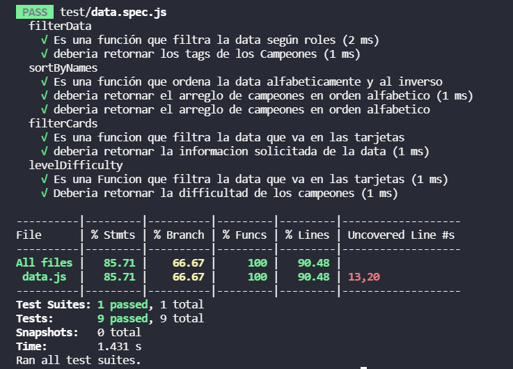

# Data Lovers

En este proyecto queremos mostrar una aplicación web responsive, capaz de visualizar y manipular data en este caso de League of Legends por medio de diversas funciones. 

## Definición de producto

Esta aplicación web va dirigida prinipalmente para quienes estan iniciando a jugar League of legends, dado que esta diseñada para que el usuario tenga una idea de que campeones podria jugar según el rol de interes, encontrara información como:

* Nombre e imagen del campeón
* Niveles de dificultad
* Clasificación por roles
* Tarjetas con: dificultad, ataque, armadura, magia y velocidad de movimiento

## Investigación UX

Realizamos una encuesta a jugadores actuales del juego para definir el diseño de la página web, donde se encontraban las siguientes preguntas:

1. ¿Cómo te gustaría ver el contenido?  

Respuestas:
* Tarjetas  69.2%
* Tablas    7.7%
* Listas    15.4%
* Otra      7.7%

2. Si elegiste otra en la anterior, ¿Cuál seria? 
* Tarjetas, pop ups

3. ¿Cómo usuario que necesitas ver en el aplicativo? ¿Por qué? **           

Respuestas:
* listado de todos los campeones en miniaturas, al elegir un campeón me muestre la información mas detallada con una imagen completa sus stats base, categoría dentro del juego...quizá su dificultad representada en estrellas o algo así, una barra de busqueda para filtrar por nombre
* informacion relacionada a los campeones, ya que son bastantes para saber sobre todos
* Barra de búsqueda de datos y builds

4. ¿Qué paleta de colores relacionas más con el juego?   

Respuestas:
* Opción 1   7.7%%

  
* Opción 2   30.8%

 
* Opción 3   7.7%

 
* Opción 4   38.5%

 
* Ninguna    15.4%

5. Si tu respuesta fue ninguna en la anterior pregunta, ¿Qué colores te gustaría que tuviera la interfaz?**

* Oscuros 
* Negro, amarillo y azul eléctrico

6. ¿Te gustaría ver clasificados a los campeones por nivel de dificultad?

* Si    92.3%
* No    7.7%

Basadas en estas respuestas construimos el prototipo inicial en papel y seguidamente en figma

Diseños en papel

Desktop

Dispositivos moviles

## Historias de usuario

### H.U 1
### "Yo como usuario quiero ver a todos los campeones con su respectivo nombre e imagen en la página principal para mejor visualización del contenido"

#### Criterios de aceptación
* Visualizar a todos los campeones en la pantalla principal
* Cada campeón debe tener su respectivo nombre
* Ver el contenido de forma ordenada
* Poder ver el contenido en desktop, tablet y celular

#### Definición de terminado
* Utilizar flexbox para la organización del contenido
* Hacer el llamado de la data para mostrar las imagenes
* Hacer llamado de la data que al mostrar las imágenes muestre los nombres
* Conseguir un diseño responsive de la página
 
### H.U 2
### "Yo como usuario del juego quiero ver la interfaz con colores oscuros para poder tener una relación más directa del juego además de la comodidad visual que esto genera"

#### Criterios de aceptación
* Interfaz de colores oscuros
* Poder asociar visualmente la aplicación web al juego
* Contraste entre colores

#### Definición de terminado
* Elegir la paleta de colores
* Determinar el background
* Determinar el color del header
* Determinar el color de los botones

### H.U 3 
### "Yo como usuario quiero una barra de búsqueda para poder acceder a la información de un campeón" 

#### Criterios de aceptación
* Poder tener una barra de búsqueda
* Barra visible en todo momento
* Buscar campeones con facilidad
* Al escribir en la barra de búsqueda, vaya mostrando opciones de Campeones.

#### Definición de terminado
* Agregar input de busqueda
* Barra de búsqueda fija
* Que el input busque solo campeones
* Input intuitivo

### H.U 4
### "Yo como usuario quiero ver el listado de campeones en orden alfabético y filtrados por rol para tener ideas de con quien puedo jugar mi  linea"

#### Criterios de aceptación
* Creación de botones para clasificar por roles
* Organizar en orden alfabético
* Que la barra de Opciones para encontrar campeones este siempre visible

#### Definición de terminado
* Función de filtrado para cada botón según el rol
* Creación de select para organizar en orden alfabético o al inverso (A-Z / Z-A)
* Creación y aplicación de Test para cada función

### H.U 5
### "Yo como usuario quiero ver clasificados a los campeones  por nivel de dificultad  para poder escoger al mejor y desarrollar mi juego"

#### Criterios de aceptación
* Lista de clasificación por dificultad
* Ver la clasificación en las tarjetas

#### Definición de terminado
* Select para indicar nivel de dificultad
* Funcionalidad de filtrado por dificultad
* Test de funcionalidad

### H.U 6
### "Yo como usuario quiero ver el contenido en tarjetas para tener comodidad de ver los datos que me interesan"

#### Criterios de aceptación
* Tarjetas de Campeones que se muestre grande
* Información de los Campeones reflejado en las Tarjetas
* Información clara de los campeones
* Visualizar Imagen del campeón

#### Definición de terminado
* Realizar filtrado de información mas relevante para el usuario (Tarjeta)
* Ubicar a los campeones en tarjetas construidas en javascript
* Maximizar tarjeta al darle click
* Test de funcionalidad

## Resultado final

## Test

