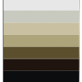

# Data Lovers

En este proyecto queremos mostrar una aplicación web responsive, capaz de visualizar y manipular data en este caso de League of Legends por medio de diversas funciones. 

## Definición de producto

Esta aplicación web va dirigida prinipalmente para quienes estan iniciando a jugar League of legends, dado que esta diseñada para que el usuario tenga una idea de que campeones podria jugar según el rol de interes, encontrara información como:

* Nombre e imagen del campeón
* Niveles de dificultad
* Clasificación por roles
* Tarjetas con: dificultad, ataque, armadura, magia y velocidad de movimiento

## Investigación UX

Realizamos una encuesta a jugadores actuales del juego para definir el diseño de la página web, donde se encontraban las siguientes preguntas:

1. ¿Cómo te gustaría ver el contenido?  

Respuestas:
* Tarjetas  69.2%
* Tablas    7.7%
* Listas    15.4%
* Otra      7.7%

2. Si elegiste otra en la anterior, ¿Cuál seria? 
* Tarjetas, pop ups

3. ¿Cómo usuario que necesitas ver en el aplicativo? ¿Por qué? **           

Respuestas:
* listado de todos los campeones en miniaturas, al elegir un campeón me muestre la información mas detallada con una imagen completa sus stats base, categoría dentro del juego...quizá su dificultad representada en estrellas o algo así, una barra de busqueda para filtrar por nombre
* informacion relacionada a los campeones, ya que son bastantes para saber sobre todos
* Barra de búsqueda de datos y builds

4. ¿Qué paleta de colores relacionas más con el juego?   

Respuestas:
* Opción 1   7.7%%

  
* Opción 2   30.8%

 
* Opción 3   7.7%

 
* Opción 4   38.5%

 
* Ninguna    15.4%

5. Si tu respuesta fue ninguna en la anterior pregunta, ¿Qué colores te gustaría que tuviera la interfaz?**

* Oscuros 
* Negro, amarillo y azul eléctrico

6. ¿Te gustaría ver clasificados a los campeones por nivel de dificultad?

* Si    92.3%
* No    7.7%

Basadas en estas respuestas construimos el prototipo inicial en papel y seguidamente en figma

Diseños en papel

Desktop

Dispositivos moviles

